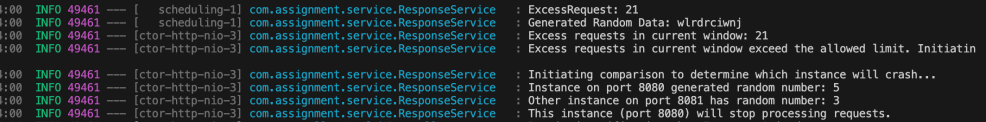
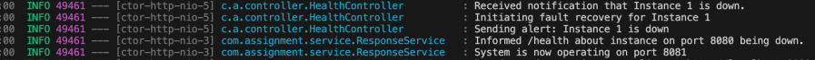
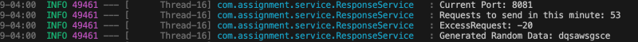

# SWEN755-Assignment1
# Web Request Handling and Health Monitoring


## Team Information

* Team name: SWEN-755.01-group4

* Team members

    * Sajjala, Swetha, ss5743

    * Ahir, Kush Jayesh, ka8540

    * Pandurangan, Bharathi, bp6191

## Project Overview
This Project focuses on the design and implementation of the heartbeat architectural tactic.
The key goal is to simulate a non-deterministic process failure and use
heartbeat monitoring to detect and recover from the crash.
This minimal prototype demonstrates the core principles of fault detection
and architectural resilience.

## Prerequisites
- Java 17.0 (Make sure to have correct JAVA_HOME setup in your environment)
- Maven
- Springboot

## System Design
### Language and Frameworks Used:
- Java: The main programming language for the application.
- Hibernate: Manages database interaction
- Spring Boot: Used to handle the application lifecycle, manage dependencies, and handle HTTP requests.

### System Overview
This system provides two API endpoints (/response and /health) with Hibernate for database interactions. It processes and manages request data while monitoring system health, implementing request throttling and a non-deterministic crash mechanism.
- /response: Receives POST requests with random string data and stores it in the response database.
- /health: Monitors the number of requests processed and determines if the system should continue functioning or crash.
1. A request is made to the /response endpoint.
2. The system checks the Flag in the health table. If the Flag is 1 or NULL, the request is processed and stored; if 0, the system halts.
3. After storing the request, the total count is updated in the health database.
4. The system limits processing to 20 requests per minute. Excess requests are discarded.
5. If the difference between the total requests and the limit exceeds 60, the Flag is set to 0 and the system crashes.
- Response: Stores request data including ID, timestamp, and linked HealthID.
- Health: Tracks the total request count, excess requests, and system status via the Flag.
- If the Flag is 0, the system stops processing further requests until reset.

## Non-Deterministic Failure:
The system generates random data for each request, introducing unpredictability in the inputs it processes. The number of incoming requests per minute is randomly generated. The system only crashes if the total excess requests exceeds a threshold. Since the number fo requests is random, the occurance of a crash cannot be predicted exactly each time the program runs.

## How to run it
1. Clone the repository and navigate to the project root directory:
```
git clone https://github.com/ka8540/SWEN755-Assignment1.git
```
```
cd SWEN755-Assignment1
```
2. Ensure your environment is set up:

* Java 17.0
- Download Java from [here](https://www.oracle.com/java/technologies/downloads/#java17)
- Download the installer for your operating system 
for windows 
```
jdk-17_windows-x64_bin.exe
```
for macOS
```
jdk-17_macos-x64_bin.dmg
```
- Verify the installation by opening a command prompt and typing:
```
java -version
```
-You should see the installed Java version.
* Maven installed and configured
- Download the Maven [here](https://maven.apache.org/download.cgi?.).
- Download the binary zip archive (e.g., `apache-maven-3.8.4-bin.zip`).

3. Run the System:
   Start the System by running: ```mvm spring-boot:run```

4. By running the program multiple times, we can observe the crash does not always occur at the same minute or with the same number of total excess requests, demonstrating its non-deterministic nature.


# Assignment2
- This project implements an **Active Redundancy** system using a load balancer to ensure high availability. The system runs two instances simultaneously, processing identical data. If one instance crashes, the other automatically takes over. The health and status of each instance are monitored continuously to maintain seamless operations.

- The system uses a load balancer to distribute incoming requests between two instances. Both instances (ports 8080 and 8081) work in parallel. The load balancer ensures that the traffic is split evenly, keeping both instances synchronized.

- Run the System
   ```
   mvn spring-boot:run -Dspring-boot.run.arguments="--spring.profiles.active=default"
   ```
   ```
   mvn spring-boot:run -Dspring-boot.run.arguments="--spring.profiles.active=instance1"
   ```



The system detects an excess number of requests, exceeding the allowed limit. 
To handle this:
- Instance 8080 generates a value of 5, and Instance 8081 generates a value of 3, representing the likelihood of each instance crashing.
- Based on these values, the system determines that Instance 8080 will stop processing since it has a higher likelihood of failure.



The Health Controller detects that Instance 8080 has gone down and initiates the fault recovery process:
- An alert is sent to notify that Instance 8080 has stopped processing.
- Instance 8081 takes over the processing of all incoming requests, ensuring the system continues operating without disruption.
- The health system is updated to reflect the change, and the system now relies on Instance 8081.



The system has successfully switched operations to Instance 8081:
- A new time window is created for processing requests.
- The system now operates with Instance 8081, preparing to handle new requests, while Instance 8080 is in recovery and will rejoin the system once it's ready.

This **active redundancy** system ensures continuous availability by dynamically transitioning between instances if one fails. With the help of the load balancer, both instances work in parallel, and if one crashes, the other continues processing. The system is resilient, able to recover quickly and maintain high availability for incoming requests.


## License
MIT license


